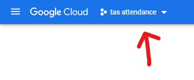

# TAS_Attendance_Bot
A bot that checks who was in a given operation during the time the bot was ran and writes that down to a google sheets file. The bot can also check if the person was in a given squad and write that down as on a seperate google sheets sheet thus creating a squad attendance sheet.

# Instructions
## Setting the environment variables
### LOG_LEVEL
The `LOG_LEVEL` environment variable can be set to either `debug`, `info`, `warn`, `error`. It is recommended to set this variable to `info`.
### LOG_LOCATION
The `LOG_LOCATION` variable is the place where all the log files will be stored. It can be either left emty and that will stop all logging activity or you can give it either a relative or an absoloute path and all the log files will be stored in that location
### MIN_PLAYERS
The `MIN_PLAYERS` variable defines the ammount of players needed for the sript to actually log people in to google sheets.
### SERVER_IP
The IP of the server
### SPREADSHEET_ID
The `SPREADSHEET_ID` variable is the id of the spreadsheet you want the bot to log to. The id can be gotten from the spreadsheet link. For example if the spreadsheet link is:

`https://docs.google.com/spreadsheets/d/1xqWRhVC5hfgdhjsiE-2beYDPUi-c2FjEHOXtrlTF9iao/edit#gid=0`

then the id will be:

`1xqWRhVC5hfgdhjsiE-2beYDPUi-c2FjEHOXtrlTF9iao`
### ALPHA, BRAVO, CHARLIE, DELTA
If a player is asigned to a squad in-game if you put their exact in-game username in one of the variables that will cause the script to log their attendace on a separate sheet along with the attendance of everyone else. You can seperate each person with a comma.
## Getting the "credentials.json file"
### Step 1.
Go to: `https://console.cloud.google.com/welcome?project=tas-attendance-359916`
### Step 2. Create a new project
To create a new project click on the button shown on the picture
