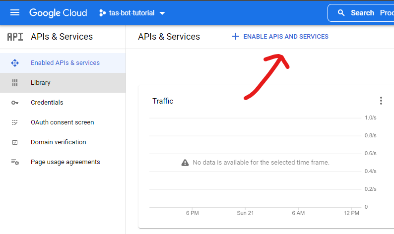
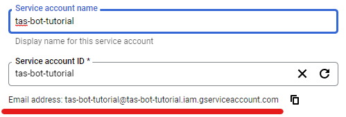

# TAS_Attendance_Bot
A bot that checks who was in a given operation during the time the bot was ran and writes that down to a google sheets file. The bot can also check if the person was in a given squad and write that down as on a seperate google sheets sheet thus creating a squad attendance sheet.

# Instructions
## Setting the environment variables
### LOG_LEVEL
The `LOG_LEVEL` environment variable can be set to either `debug`, `info`, `warn`, `error`. It is recommended to set this variable to `info`.
### LOG_LOCATION
The `LOG_LOCATION` variable is the place where all the log files will be stored. It can be either left emty and that will stop all logging activity or you can give it either a relative or an absoloute path and all the log files will be stored in that location
### MIN_PLAYERS
The `MIN_PLAYERS` variable defines the ammount of players needed for the sript to actually log people in to google sheets.
### SERVER_IP
The IP of the server
### SPREADSHEET_ID
The `SPREADSHEET_ID` variable is the id of the spreadsheet you want the bot to log to. The id can be gotten from the spreadsheet link. For example if the spreadsheet link is:

`https://docs.google.com/spreadsheets/d/1xqWRhVC5hfgdhjsiE-2beYDPUi-c2FjEHOXtrlTF9iao/edit#gid=0`

then the id will be:

`1xqWRhVC5hfgdhjsiE-2beYDPUi-c2FjEHOXtrlTF9iao`
### ALPHA, BRAVO, CHARLIE, DELTA
If a player is asigned to a squad in-game if you put their exact in-game username in one of the variables that will cause the script to log their attendace on a separate sheet along with the attendance of everyone else. You can seperate each person with a comma.
## Getting the "credentials.json" file
### Step 1.
Go to: `https://console.cloud.google.com/`
### Step 2. Create a new project
To create a new project click on the button shown on the picture

then click on the "New Project" button and give your project a name.After the project is done creating <u>make sure you have selected the right project</u>
### Step 3. Enable APIs and Services
Open the menu on the top left hand side of the window and hover over "APIs & Services" and then click on "Enable APIs & services". Click on the other "ENABLE APIS AND SERVICES" button that's shown in the picture.

Search for "sheets" in the search box and click on "Google Sheets API" and click the blue "Enable" button.
### Step 4. Getting your credentials
Once the page loads click on the "Credentials" option on the left menu bar. Click on the "CREATE CREDENTIALS" button at the top and select "Service account". Fill in the "Service account name" and coppy the email that is shown in the picture

now just spam the "DONE" button
### Step 5. Getting your credentials
Click on the email you got, go to the "KEYS" section at the top and click "ADD KEY". Select "Create new key",make sure "JSON" is selected and press the "CREATE" button. Now save that file in the base directory of the bot and rename it to "credentials.json".
## Setting up the google sheets document
### Step 1. Create a new google sheets file and name it however you want.
### Step 2. Renaming and adding all the needed sheets
At the botton of the page rename the "Sheets1" sheet to "All" and then add four new sheets with the names "Alpha", "Bravo", "Charlie" and "Delta"
### Step 3. Giving the bot write permissions
Click the green "Share" at the top right of the screen, give the sheet a name and save it. Then paste the bot email in the "Add people and groups" field, make sure the bot is an "Editor" and uncheck the "Notify people" checkbox then click send
## Building and running the docker image
### Step 1. Building the docker image
Open a terminal window in the base directory of the bot and run `docker build -t <IMAGE_NAME> .`
### Step 2. Running the docker image through the Docker desktop application.
Open the Docker desktop app and go to "Images". There you should see an image with the name you gave it in the previous step. Hover over it and click the "RUN" button. Under "Optional settings" give the container a name and if you have enabled logging under volumes you can select a "Host path" which is the location where all log files will be saved on your local machine and under "Container path" put "/app/logs". Click run.